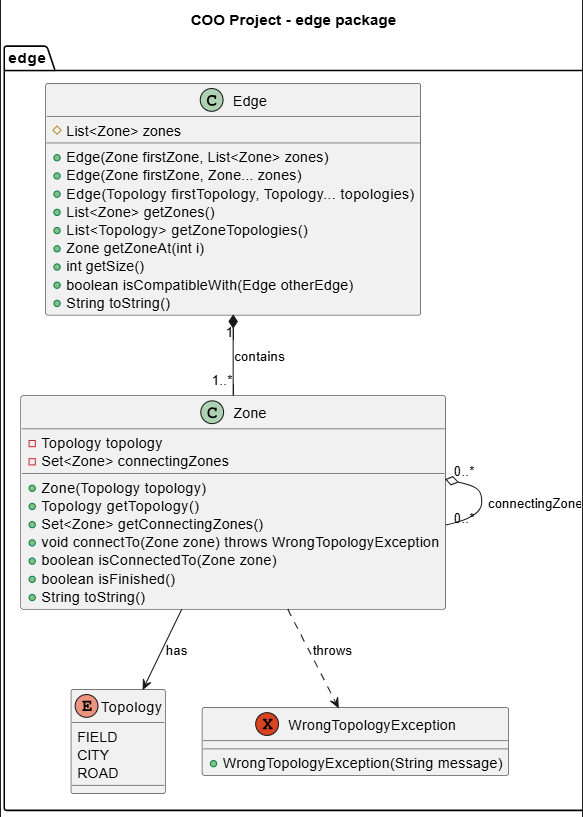
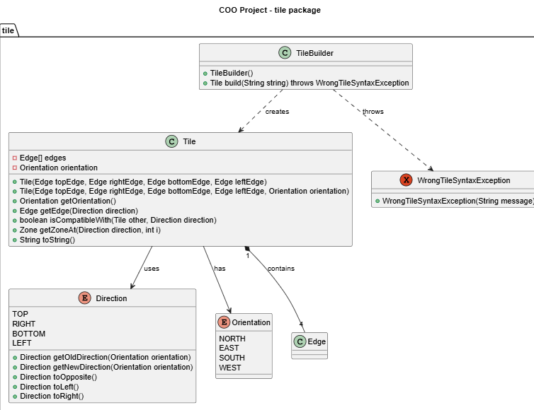

# GameElements Library

Bibliothèque Java pour créer des éléments de jeu Carcassonne.

## TileBuilder

**Rôle** : Construit une tuile à partir d'une chaîne de caractère formatée.

### Format de Chaîne
```
[Orientation][TopEdge]-[RightEdge]-[BottomEdge]-[LeftEdge]

Orientation: N, E, S, W
Edge: [topology1][id1][topology2][id2]
Topology: f (field), c (city), r (road)

Deux éléments possédant le même id et la même topologie sont reliés sur la tuile.
```

### Utilisation
Pour construire ces tuiles :  


```java
TileBuilder builder = new TileBuilder();
Tile tile1 = builder.build("Nc3-f1r4f2-f2-f2r4f1"); 
Tile tile2 = builder.build("Nc1-c1-f2r0f3-c1"); 
```

La méthode build renvoie WrongTileSyntaxException si la chaîne est mal formée.

## Tile

**Rôle** : représente une tuile de jeu avec 4 bords.

### Format de Chaîne

La méthode `toString()` d'une tuile permet d'obtenir sa représentation en chaîne de caractères.

### Orientation

La tuile possède une orientation définie à sa création et qui ne peux pas être modifiée.  
On peut l'obtenir avec la méthode `getOrientation()`.

Orientation NORTH:  


Orientation EAST:  


Orientation SOUTH:  


Orientation WEST:  


### Direction et Edge

Une tuile possède quatre `edge` représentant chaque bord. De plus il existe 4 directions (TOP, RIGHT, BOTTOM, LEFT) pour situé un bord. Ainsi on peut récupérer un bord de la tuile grâce à la méthode `getEdge(Direction)`.
 


Peu importe l'orientation de la tuile, getEdge(TOP) renvoie toujours le bord situé en haut comme illustré ci-dessus. Ainsi getEdge(TOP) renvoie une ville dans le premier cas et des plaines avec une route dans le second.

### Vérification compatibilité

On peut vérifier la compatibilité d'une autre tuile placée sur une direction d'une tuile initiale en fonction de leurs orientations.

Cas compatible :  

  
La tuile de gauche est orientée vers l'est et la tuile de droite vers le sud.
```java
tuileGauche.isCompatible(tuileDroite,Direction.RIGHT); // renvoie True
tuileDroite.isCompatible(tuileGauche,Direction.LEFT); // renvoie True
```

Cas non compatible:  

  
La tuile de gauche est orientée vers le sud et la tuile de droite vers le sud.
```java
tuileGauche.isCompatible(tuileDroite,Direction.RIGHT); // renvoie False
tuileDroite.isCompatible(tuileGauche,Direction.LEFT); // renvoie False
```

## Orientation

L'enum Orientation possèdent les méthodes suivantes permettant de manipuler ses instances simplement :  
NORTH.rotateHalf() -> SOUTH  
NORTH.rotateLeft() -> WEST  
NORTH.rotateRight() -> EAST  

## Direction

L'enum Direction possèdent les méthodes suivantes permettant de manipuler ses instances simplement :  
TOP.toOpposite() -> BOTTOM  
TOP.toLeft() -> LEFT  
TOP.toRight() -> RIGHT  
TOP.getOldDirection(EAST) -> LEFT (return the old direction of something before the orientation)  
TOP.getNewDirection(EAST) -> RIGHT (return the new direction of something after the orientation) 

## Zone

Un `Edge` représente un bord et possède une ou plusieurs zones.  
Une `Zone` possède une certaine topologie (`CITY`, `FIELD`, `ROAD`) que l'on obtient avec `getTopology()` et des zones connectées.

### getZoneAt

  
Pour obtenir la zone de ville en haut de la tuile ci-dessus:

```java
tile.getZoneAt(Direction.TOP, 0);
```

Pour obtenir la zone de route à droite de la tuile ci-dessus:
```java
tile.getZoneAt(Direction.RIGHT, 1);
```

Pour obtenir la zone de plaine sous la route à gauche de la tuile ci-dessus:
```java
tile.getZoneAt(Direction.LEFT, 2);
```

### Zones connexions

Pour obtenir l'ensemble des zones connectées à une zone : 
```java
zone.getConnectingZones()
```

Pour savoir si une zone n'est connectée à aucune autre zone : 
```java
zone.isFinished()
```
Par exemple :  
  
Sur la tuile ci-dessus, la zone de gauche a pour zones connectées la zone en haut et à droite et respectivement pour la zone en haut et à droite. Les zones en bas sont terminées.


## Umls

 

  
