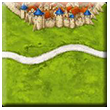
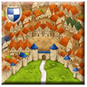
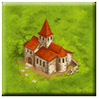
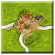
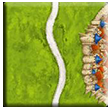
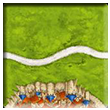
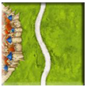
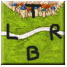
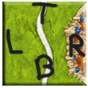
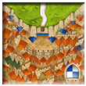

# GameElements Library

Bibliothèque Java pour créer et manipuler des éléments de jeu Carcassonne.

---

## TileBuilder

**Rôle** : Construit une tuile à partir d'une chaîne de caractère formatée.

### Format de Chaîne
```
[Orientation](A)[TopEdge]-[RightEdge]-[BottomEdge]-[LeftEdge]

Orientation: N (NORTH), E (EAST), S (SOUTH), W (WEST)
A (optionnel) : indique la présence d'une abbaye sur la tuile
Edge : suite de zones, chacune sous la forme [topology][id]
Topology: f (field), c (city), C (city with shield), r (road)

Deux zones possédant le même id et la même topologie sont reliés sur la tuile.
```

### Utilisation
Pour construire ces tuiles :  





```java
TileBuilder builder = new TileBuilder();
Tile tile1 = builder.build("Nc3-f1r4f2-f2-f2r4f1"); 
Tile tile2 = builder.build("NC1-C1-f1r0f2-C1"); 
Tile tile3 = builder.build("NAf1-f1-f1-f1"); 
Tile tile4 = builder.build("Nf1-f1r1f2-f2r2f3-f3r3f1"); 
```

La méthode `build()` lève `WrongTileSyntaxException` si la chaîne est mal formée.

---

## Tile

**Rôle** : représente une tuile de jeu avec 4 bords.

### Format de Chaîne

La méthode `toString()` retourne la représentation textuelle de la tuile, prenant en compte les connexions entre zones et l'orientation.

### Orientation

La tuile possède une orientation définie à sa création.  
On peut l'obtenir avec la méthode `getOrientation()` et la modifier avec `setOrientation(Orientation)`.

Orientation NORTH:  


Orientation EAST:  


Orientation SOUTH:  


Orientation WEST:  


La tuile peut être tournée avec les méthodes `tile.rotateRight()`, `tile.rotateLeft()` et `tile.rotateHalf()`.

### Direction et Edge

Une tuile possède quatre `edge` représentant chaque bord. De plus il existe 4 directions (TOP, RIGHT, BOTTOM, LEFT) pour situé un bord. Ainsi on peut récupérer un bord de la tuile grâce à la méthode `getEdge(Direction)`.
 



Peu importe l'orientation de la tuile, `getEdge(TOP)` renvoie toujours le bord situé en haut comme illustré ci-dessus. Ainsi `getEdge(TOP)` renvoie une ville dans le premier cas et des plaines avec une route dans le second.

### Vérification compatibilité

On peut vérifier la compatibilité d'une autre tuile placée sur une direction d'une tuile initiale en fonction de leurs orientations respectives.

Cas compatible :  

  
La tuile de gauche est orientée vers l'est et la tuile de droite vers le sud.
```java
tuileGauche.isCompatible(tuileDroite,Direction.RIGHT); // renvoie True
tuileDroite.isCompatible(tuileGauche,Direction.LEFT); // renvoie True
```

Cas non compatible:  

  
La tuile de gauche est orientée vers le sud et la tuile de droite vers le sud.
```java
tuileGauche.isCompatible(tuileDroite,Direction.RIGHT); // renvoie False
tuileDroite.isCompatible(tuileGauche,Direction.LEFT); // renvoie False
```

### Abbaye

```java
tile.hasAbbey();                     // true si la tuile possède une abbaye
tile.setAbbeyMeeple(meeple);         // Place un meeple sur l'abbaye
tile.getAbbeyMeeple();               // Retourne le meeple de l'abbaye
tile.giveBackAbbeyMeeple();          // Retire le meeple et le rend au joueur
tile.hasMeepleOnAbbey();             // true si un meeple est sur l'abbaye
```

### Meeple

Retourne le meeple présent sur la tuile (abbaye ou bord), accompagné d'un identifiant de position :

```java
Pair<Meeple, String> pair = tile.getMeeple(); // null si aucun meeple
```

L'identifiant de position est `"A"` pour l'abbaye, ou une chaîne de la forme `"T0"`, `"R1"`, etc. (direction + index de zone).

---

## Orientation

Enum avec les valeurs `NORTH`, `EAST`, `SOUTH`, `WEST`.

```java
NORTH.rotateRight()  // → EAST
NORTH.rotateLeft()   // → WEST
NORTH.rotateHalf()   // → SOUTH

Orientation.fromChar('E'); // → EAST
orientation.toString();    // → "N", "E", "S" ou "W"
```

---

## Direction

Enum avec les valeurs `TOP`, `RIGHT`, `BOTTOM`, `LEFT`.

```java
TOP.toOpposite()             // → BOTTOM
TOP.toRight()                // → RIGHT
TOP.toLeft()                 // → LEFT

TOP.getOldDirection(EAST)    // → LEFT  (direction avant rotation)
TOP.getNewDirection(EAST)    // → RIGHT (direction après rotation)

Direction.fromChar('T')      // → TOP  (lève WrongTileSyntaxException si invalide)
Direction.toChar(Direction.RIGHT) // → 'R'
```

---

## Edge

**Rôle** : Représente un bord de tuile, composé d'une ou plusieurs zones.

### Constructeurs

```java
new Edge(Zone firstZone, Zone... zones);
new Edge(Zone firstZone, List<Zone> zones);
new Edge(Topology firstTopology, Topology... topologies); // crée les zones automatiquement
```

### Méthodes principales

```java
edge.getSize();                  // Nombre de zones sur ce bord
edge.getZones();                 // Liste de toutes les zones
edge.getZoneAt(int i);           // i-ème zone (0-indexé)
edge.getZoneTopologies();        // Liste des topologies des zones
edge.isCompatibleWith(otherEdge); // true si les bords sont compatibles (comparaison symétrique miroir)
edge.getMeeple();                // Retourne le meeple présent (Pair<Meeple, String>), ou null
edge.toString();                 // Concaténation des toString() de chaque zone
```

Deux bords sont compatibles si, pour chaque position `i`, la topologie à la position `i` du premier bord correspond à la topologie à la position `size-i-1` du second (comparaison en miroir).

---

## Zone

**Rôle** : Unité élémentaire d'un bord, caractérisée par une topologie et reliée à d'autres zones de la tuile ou du plateau.

### Topologie

```java
zone.getTopology(); // Retourne FIELD, CITY ou ROAD
```

### getZoneAt

  

Pour obtenir une zone à partir d'une tuile:

```java
tile.getZoneAt(Direction, index);
tile.getZoneAt(Direction.TOP, 0); // zone de ville en haut de la tuile
tile.getZoneAt(Direction.RIGHT, 1); // zone de route à droite de la tuile
tile.getZoneAt(Direction.RIGHT, 2); // zone de plaine sous la route à droite de la tuile
tile.getZoneAt(Direction.LEFT, 0); // zone de plaine sous la route à gauche de la tuile
```

### Connexions entre zones (sur la même tuile)

```java
zone.connectTo(otherZone);           // Relie deux zones de manière bidirectionnelle (lève WrongTopologyException si incompatibles)
zone.isConnectedTo(otherZone);       // true si les deux zones sont directement reliées
zone.getConnectingZones();           // Ensemble des zones directement reliées
zone.isNotConnected();               // true si la zone n'est reliée à aucune autre zone
```
Par exemple :  
  
Sur la tuile ci-dessus, la zone de gauche a pour zones connectées la zone en haut et à droite et respectivement pour la zone en haut et à droite. Les zones en bas ne sont pas connectées.

### Zone adjacente (entre tuiles voisines sur le plateau)

```java
zone.setAdjacentZone(otherZone);     // Lie deux zones de tuiles adjacentes sur un plateau (liaison bidirectionnelle)
zone.removeAdjacentZone(otherZone);  // Supprime la liaison adjacente
zone.getAdjacentZone();              // Retourne la zone adjacente, ou null
zone.hasAdjacentZone();              // true si une zone adjacente existe
```

### Zone de plateau

```java
zone.getAllBoardConnectingZones();    // Toutes les zones reliées en parcourant le plateau
```

Exemple:   

  

```java
tile1.getZoneAt(Direction.TOP, 0).getAllBoardConnectingZones(); // Renvoie les zones des bords supérieur, droit et gauche de la tuile 1, ainsi que la zone du bord gauche de la tuile 2.
```

### Bouclier

```java
zone.hasShield(); // true si la zone de ville possède un bouclier
zone.setShield(); // Active le bouclier sur la zone
```  

### Meeple

```java
zone.setMeeple(meeple);   // Place un meeple (lève WrongTopologyException sur FIELD,
                          // AlreadyHaveMeepleException si occupé, NoMeepleException si plus de meeple)
zone.getMeeple();         // Retourne le meeple, ou null
zone.hasMeeple();         // true si un meeple est présent
zone.giveBackMeeple();    // Retire le meeple et le rend au joueur (lève NoMeepleException)
```

**Note** : les meeples ne peuvent pas être placés sur les zones de type `FIELD`.

---

## Topology

Enum avec les valeurs `FIELD`, `CITY`, `ROAD`.

```java
Topology.FIELD.toString() // → "f"
Topology.CITY.toString()  // → "c"
Topology.ROAD.toString()  // → "r"
```

---

## Board

**Rôle** : Représente le plateau de jeu. Initialisé avec une tuile de départ aux coordonnées `(0, 0)`.

### Gestion des tuiles

```java
board.putTileAt(tile, coord);   // Place une tuile et établit les adjacences avec les voisins
board.removeTileAt(coord);      // Retire une tuile et supprime les adjacences
board.hasTile(coord);           // true si une tuile occupe ces coordonnées
board.getTileAt(coord);         // Retourne la tuile à ces coordonnées, ou null
board.getTiles();               // Collection de toutes les tuiles posées
```

### Frontières

```java
board.getOutsideFrontierTiles(); // Ensemble des coordonnées vides adjacentes à une tuile posée
```

### Dimensions

```java
board.getMinX(); board.getMaxX(); // Coordonnées X extrêmes des tuiles posées
board.getMinY(); board.getMaxY(); // Coordonnées Y extrêmes des tuiles posées
```

Lors du placement d'une tuile, les zones de bord sont automatiquement liées (`setAdjacentZone`) avec les zones correspondantes des tuiles voisines.

---

## Coordinates

**Rôle** : Représente une position sur le plateau. L'axe Y est positif vers le haut et l'axe X positif vers la droite.

### Création

```java
new Coordinates(int x, int y);
new Coordinates(Pair<Integer, Integer> pair);
```

### Navigation

```java
coord.getX(); coord.getY();
coord.getAdjacent(Direction.TOP);    // Coordonnées dans la direction donnée
coord.upCoordinates();               // Équivalent à getAdjacent(TOP)
coord.downCoordinates();
coord.rightCoordinates();
coord.leftCoordinates();
coord.getAdjacentCoordinates();               // Liste des 4 coordonnées adjacentes (haut, droite, bas, gauche)
coord.getAdjacentAndCornerCoordinates();      // Ensemble des 8 coordonnées voisines (adjacentes + diagonales)
```

### Égalité et hashCode

`equals()` et `hashCode()` sont redéfinis pour permettre l'utilisation dans des `Map` et `Set`.

```java
coord.toString(); // → "(x,y)"
```

---

## Player

**Rôle** : Représente un joueur avec un score, un nombre de blâmes et un stock de meeples.

```java
new Player(String id, int nbMeeples);

player.getID();
player.getScore();
player.addPoints(int points);
player.blame();
player.getNumberOfBlames();

player.getNbMeeples();
player.hasMeeples();
player.incrementMeepleCount();
player.decrementMeepleCount(); // Lève NoMeepleException si le joueur n'a plus de meeple
```

---

## Meeple

**Rôle** : Représente un pion appartenant à un joueur, placé à des coordonnées données.

```java
new Meeple(Player player, Coordinates coordinates);

meeple.getPlayer();
meeple.getCoordinates();

meeple.decrementPlayerMeeple(); // Décrémente le stock du joueur (lève NoMeepleException)
meeple.incrementPlayerMeeple(); // Incrémente le stock du joueur
```

Les méthodes `setMeeple()` et `setAbbeyMeeple()` appellent `decrementPlayerMeeple()` automatiquement.  
Les méthodes `giveBackMeeple()` et `giveBackAbbeyMeeple()` appellent `incrementPlayerMeeple()` automatiquement.
